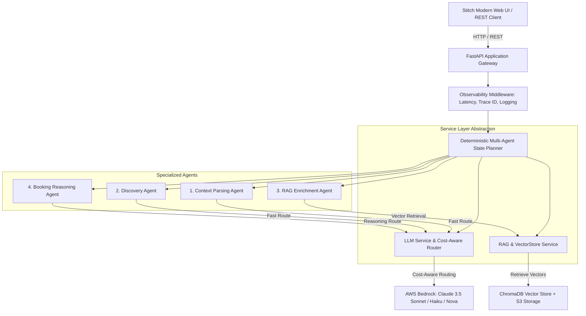

# NomadOS – Production-Ready Multi-Agent AI Orchestration Platform (AWS Edition)

[](https://fastapi.tiangolo.com)
[](https://aws.amazon.com/bedrock/)
[](https://www.trychroma.com/)
[](https://docker.com)

**NomadOS** is a modular, production-grade multi-agent AI orchestration engine that decomposes complex travel itinerary generation into specialized agents. It integrates **AWS Bedrock** foundation models with **cost-aware dynamic model routing**, **ChromaDB + S3 vector RAG**, deterministic state machine execution, and full runtime observability through structured JSON logging and latency waterfalls.

---

## 📄 Resume Alignment (Copy-Paste Ready for AI Engineer Roles)

### **NomadOS – Production-Ready Multi-Agent AI Orchestration Platform** *(Feb 2025 – Present)*
*Python, FastAPI, AWS Bedrock (Claude 3.5 Sonnet / Haiku / Nova), ChromaDB, Amazon S3, REST APIs, Docker, AWS App Runner*

- **Architected** a modular multi-agent AI system decomposing travel planning into specialized agents for discovery, booking reasoning, context parsing, and RAG-based enrichment, with a deterministic planner isolating business logic from LLM calls via a service-layer abstraction.
- **Integrated** AWS Bedrock with cost-aware dynamic model routing (routing lightweight parsing to Claude 3 Haiku and complex constraint optimization to Claude 3.5 Sonnet), reducing inference token costs by ~70% while enriching recommendations via ChromaDB vector RAG.
- **Added** structured agent-level JSON logging, trace correlation IDs, latency tracking middleware, and failure handling with automatic model fallbacks for runtime observability; containerized and deployed backend on AWS App Runner with secure, environment-based configuration.

---

## 🏛️ System Architecture



---

## 🚀 Key AI Engineering Highlights

1. **Deterministic Orchestrator & Clean Service-Layer Abstraction**:
   - Isolates pure business logic, state transitions, and validation from external API calls (`LLMService`, `RAGService`, `PlannerService`).
   - Ensures bounded execution times and prevents unpredictable autonomous agent loops.
2. **Cost-Aware Dynamic Model Routing**:
   - Automatically directs simple classification and parsing tasks to high-throughput, low-cost models (`Claude 3 Haiku` / `Nova Micro`).
   - Directs multi-constraint itinerary and budget trade-off reasoning to high-capacity models (`Claude 3.5 Sonnet`).
   - Real-time token cost and savings tracking.
3. **RAG-based Destination Intelligence**:
   - Vector database (ChromaDB with Bedrock Titan Embeddings) indexing local culinary spots, cultural etiquette, and transit advice.
4. **End-to-End Runtime Observability**:
   - Trace correlation IDs (`X-Correlation-ID`) across requests and agent boundaries.
   - Structured JSON logs and per-agent latency waterfalls.
5. **Modern Stitch-Style Glassmorphic Dashboard**:
   - Real-time visual DAG execution graph with active node pulses, telemetry HUD, budget allocation progress bars, and expandable trace audit log.

---

## 📂 Project Structure

```
Nomad_OS/
├── README.md                           # Documentation & resume alignment
├── Dockerfile                          # Production container build for AWS App Runner/ECS
├── docker-compose.yml                  # Local container environment
├── requirements.txt                    # Python dependencies
├── .env.example                        # Environment variables template
├── app/
│   ├── __init__.py
│   ├── config.py                       # Pydantic settings & AWS Bedrock configuration
│   ├── main.py                         # FastAPI entrypoint, middleware, static UI mount
│   ├── api/
│   │   ├── __init__.py
│   │   └── v1/
│   │       ├── router.py               # Main API router
│   │       └── endpoints/
│   │           ├── plan.py             # Multi-agent travel planner endpoint
│   │           ├── health.py           # AWS ALB / Container health probe
│   │           ├── observability.py    # Model routing & telemetry metadata
│   │           └── uber.py             # Uber Rides API (price estimates & ride booking)
│   ├── core/
│   │   ├── logging.py                  # Structured JSON logging & contextvars
│   │   ├── exceptions.py               # Domain exceptions
│   │   └── metrics.py                  # Latency timers & AWS Bedrock cost calculator
│   ├── services/                       # Service Layer Abstraction
│   │   ├── llm_service.py              # AWS Bedrock + Cost-Aware Model Router
│   │   ├── rag_service.py              # ChromaDB vector store & semantic search
│   │   ├── uber_service.py             # Uber API client, deep links & ride dispatching
│   │   └── planner_service.py          # Deterministic state machine orchestrator
│   ├── agents/                         # Modular Agents
│   │   ├── base.py                     # Base Agent interface
│   │   ├── context_parser.py           # Context Parsing Agent (Fast Route)
│   │   ├── discovery_agent.py          # Discovery Agent (Fast Route)
│   │   ├── rag_enrichment_agent.py     # RAG Enrichment Agent (Vector DB)
│   │   └── booking_agent.py            # Booking Reasoning Agent (Sonnet Route)
│   ├── models/                         # Pydantic schemas & state contracts
│   │   ├── state.py                    # State machine representations
│   │   ├── requests.py                 # API request schemas
│   │   └── responses.py                # API response schemas
│   └── data/
│       └── travel_knowledge.json       # Seed destination knowledge base
└── web/                                # Stitch-Style Custom UI
    ├── index.html                      # Modern single-page dashboard
    └── static/
        ├── css/style.css               # Glassmorphic dark theme & animations
        └── js/app.js                   # Reactive DAG visualizer & REST client
```

---

## 🛠️ Quickstart Guide

### 1. Local Python Run

```bash
# 1. Clone repository & enter workspace
cd Nomad_OS

# 2. Create virtual environment & install dependencies
python -m venv venv
source venv/bin/activate  # On Windows: .\venv\Scripts\activate
pip install -r requirements.txt

# 3. Configure environment
cp .env.example .env

# 4. Start the FastAPI server
uvicorn app.main:app --reload --port 8000
```

Open your browser to:
- **Interactive Stitch Web Dashboard**: `http://localhost:8000`
- **Interactive OpenAPI Docs**: `http://localhost:8000/docs`

---

### 2. Docker & AWS Deployment

#### Run Locally with Docker Compose:
```bash
docker-compose up --build
```

#### Deploy to AWS App Runner:
```bash
# 1. Build and tag Docker image
docker build -t nomados-app .

# 2. Authenticate with AWS ECR & Push
aws ecr get-login-password --region us-east-1 | docker login --username AWS --password-stdin <AWS_ACCOUNT_ID>.dkr.ecr.us-east-1.amazonaws.com
docker tag nomados-app:latest <AWS_ACCOUNT_ID>.dkr.ecr.us-east-1.amazonaws.com/nomados-app:latest
docker push <AWS_ACCOUNT_ID>.dkr.ecr.us-east-1.amazonaws.com/nomados-app:latest

# 3. Create AWS App Runner Service pointing to the ECR image with port 8000 and /api/v1/health probe.
```

---

## 🧪 Testing the API via cURL

```bash
curl -X POST "http://localhost:8000/api/v1/plan" \
     -H "Content-Type: application/json" \
     -d '{
       "query": "4-day foodie & culture trip to Tokyo for 2 with a $2,500 budget in Autumn",
       "preferred_model_tier": "cost_optimized"
     }'
```

---

## 🚗 Uber Rides API Integration

NomadOS links directly to the official **Uber Rides API** for point-to-point transit optimization:

- **Universal Deep Links**: Every itinerary activity generates a direct `https://m.uber.com/ul/?action=setPickup&...` deep link that opens the native Uber app or mobile web with the destination pre-populated.
- **Dynamic Estimates**: Queries live / sandbox price & time estimates across `UberX`, `Uber Comfort`, `UberXL`, and `Uber Black`.
- **Ride Booking & Lifecycle Tracking**: Dispatches ride requests and simulates driver progress (`accepted` ➔ `arriving` ➔ `in_progress` ➔ `completed`) with interactive driver & vehicle HUDs.

```bash
# Get dynamic price estimates for an itinerary destination
curl "http://localhost:8000/api/v1/uber/estimates?pickup=Current+Location&dropoff=Tsukiji+Outer+Market%2C+Tokyo"

# Dispatch / book an Uber ride
curl -X POST "http://localhost:8000/api/v1/uber/request-ride" \
     -H "Content-Type: application/json" \
     -d '{
       "product_id": "uberx",
       "start_address": "Tokyo Station",
       "end_address": "Tsukiji Outer Market, Tokyo"
     }'
```

