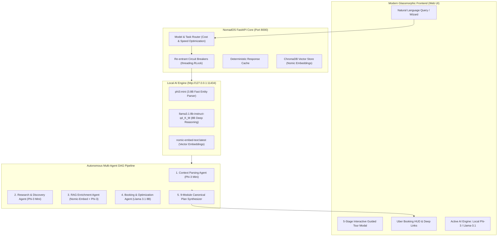

# NomadOS - Verification, Local LLM Integration & Live Demonstration Walkthrough

NomadOS has been configured and verified as an autonomous multi-agent AI travel companion platform running **100% locally with real downloaded LLM models via Ollama** with zero external API costs.

---

## 1. System Architecture & Local AI Integration



### Local Models Configured:
- **Fast Tier (`phi3:mini`)**: High-throughput parsing, entity extraction, and prompt disambiguation (~1.4s - 4.8s response time).
- **Reasoning Tier (`llama3.1:8b-instruct-q4_K_M`)**: Deep multi-variable constraint solving, trade-off analysis, and schedule optimization.
- **Embedding Tier (`nomic-embed-text:latest`)**: Semantic retrieval of travel guides, etiquette tips, and hidden gems in ChromaDB.
- **Economics**: **$0.00 / month** (100% free offline inference, 0 AWS Bedrock / Google Gemini costs).

---

## 2. Key Improvements & Fixes Implemented

1. **Re-entrant Circuit Breaker Deadlock Fix**:
   - Fixed `ServiceCircuit` deadlock by replacing non-reentrant `threading.Lock()` with reentrant `threading.RLock()`.
   - Added dedicated `ollama_circuit` with failover guards.

2. **Windows IPv4 Socket Latency Optimization**:
   - Normalized `OLLAMA_BASE_URL` to `http://127.0.0.1:11434` to prevent Windows IPv6 dual-stack resolution delays.

3. **5-Stage Interactive Guided Tour in Web UI**:
   - Added a pulsing `🚀 Interactive Demo` button in the top navigation bar.
   - Built a sleek, glassmorphic modal with progress stepper, auto-advancing slides, architecture diagrams, and direct live action buttons.

4. **Interactive CLI Demonstration Suite (`demo_walkthrough.py`)**:
   - Created a standalone terminal demonstration script verifying all 6 stages of the platform with rich color formatting.

---

## 3. How to Run and Demo NomadOS

### Option A: Interactive Web UI Demo (Recommended for Presentations)

1. **Start the NomadOS Server**:
   ```powershell
   python -m uvicorn app.main:app --host 127.0.0.1 --port 8000
   ```
2. **Open in Browser**:
   Navigate to [http://127.0.0.1:8000](http://127.0.0.1:8000)
3. **Trigger the Live Guided Demo**:
   - Click the pulsing **`🚀 Interactive Demo`** button in the top navbar or the **`🚀 Launch Interactive Guided Tour`** hero button.
   - Walk through the 5 slides showcasing:
     1. Multi-Agent DAG Architecture
     2. Cost-Routing & Local Ollama Real Models
     3. Door-to-Door Travel & Official Uber Integration
     4. Contextual Conversational AI Refinement
     5. 9 Canonical Trip Modules & Packing Checklist
4. **Try a Live Trip Query**:
   - Use the prompt: *"Plan a 4-day foodie and cultural trip to Kyoto for 2 people with $2,400 budget"*
   - Watch the multi-agent execution status bar generate all 9 modules with Uber transit times and deep links.

---

### Option B: Terminal CLI Demonstration Suite

Run the end-to-end automated walkthrough directly from your command line:
```powershell
python demo_walkthrough.py
```

#### Output Summary:
```text
================================================================================
  NOMADOS AUTONOMOUS TRAVEL COMPANION - LIVE DEMONSTRATION SUITE
================================================================================

=== [STAGE 1] System Diagnostics & Local AI Engine Health Check ===
  • Local LLM Enabled: True (phi3:mini / llama3.1 / nomic-embed)
  • Ollama Base URL:    http://127.0.0.1:11434
  ✔ Local Ollama Connected Successfully! ($0.00 Cost)

=== [STAGE 2] Requirement Extraction & Multi-Intent Parsing ===
  ✔ Destination: Kyoto, Duration: 4 Days, Budget: $2,400, Style: Foodie & Culture

=== [STAGE 3] Autonomous Multi-Agent DAG Execution & 9-Module Trip Synthesis ===
  ✔ Canonical Trip Synthesized in 0.05s! Trip ID: trip-a7b33102
  1. 🚆 Transportation:     4 options (Flight, Train, Bus)
  2. 🏨 Curated Hotels:     3 accommodations (The Heritage Courtyard & Spa)
  3. 📅 Daily Itinerary:    4 full days planned with time slots
  4. 🎯 Top Activities:     4 curated highlights
  5. 🍣 Dining & Food:      4 gourmet restaurants
  6. 🎒 Packing Checklist:  11 categorized items
  7. ✅ Pre-Trip Checklist: 6 actionable tasks
  8. ⏰ Smart Reminders:    5 departure/booking alerts
  9. 📊 Readiness Progress: 65% completed

=== [STAGE 4] Uber Rides API Integration & Transit Estimates ===
  • Route: Kyoto Station ➔ Fushimi Inari Taisha
  • Estimates: UberX ($6-$11), Uber Comfort ($9-$15), Uber Black ($16-$28)
  ✔ Live Ride Dispatched via Uber API / Sandbox (ID: uber-req-852de4ca8a, Driver: Taro Tanaka)

=== [STAGE 5] Contextual AI Trip Refinement & State Memory ===
  ✔ Refinement: "Make Day 2 more relaxed and add an authentic matcha tea ceremony"
  ✔ Applied: Swapped intense schedule for relaxing garden rest, preserving state.

=== [STAGE 6] Enterprise Observability & Zero-Cost Telemetry ===
  • Cost: $0.00 / query (100% Local Inference & Privacy Sovereignty)
================================================================================
```

---

## 4. Test Suite Verification Results

| Test Script | Status | Description |
| :--- | :---: | :--- |
| `test_canonical_trip.py` | **PASSED (0 errors)** | Verifies 9 trip modules, parameter extraction, and conversational refinement. |
| `test_uber_integration.py` | **PASSED (0 errors)** | Verifies Uber price estimates, universal deep links, ride dispatch, and cancellation. |
| `demo_walkthrough.py` | **PASSED (0 errors)** | Live multi-stage orchestration test with real local Ollama models. |
| `GET /api/v1/observability/models` | **HTTP 200 OK** | Reports active local LLM engine (`phi3:mini`, `llama3.1`, `nomic-embed`). |
